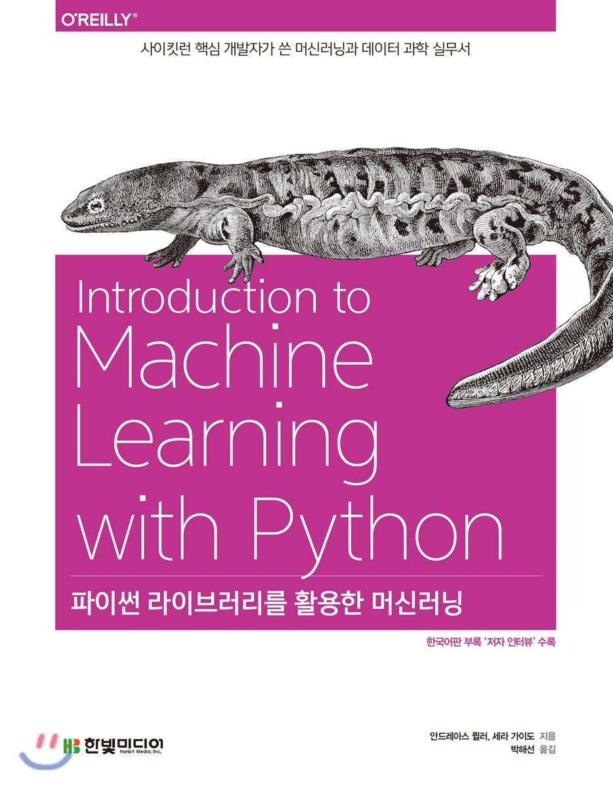

## 파이썬 라이브러리를 활용한 머신러닝

### Contents
- Chapter1 소개
- Chapter2 지도 학습
- Chapter3 비지도 학습과 전처리
- Chapter4 데이터 표현과 특성 공학
- Chapter5 모델 평가와 성능 향상
- Chapter6 알고리즘 체인과 파이프라인
- Chapter7 텍스트 데이터 다루기
- Chapter8 마무리
