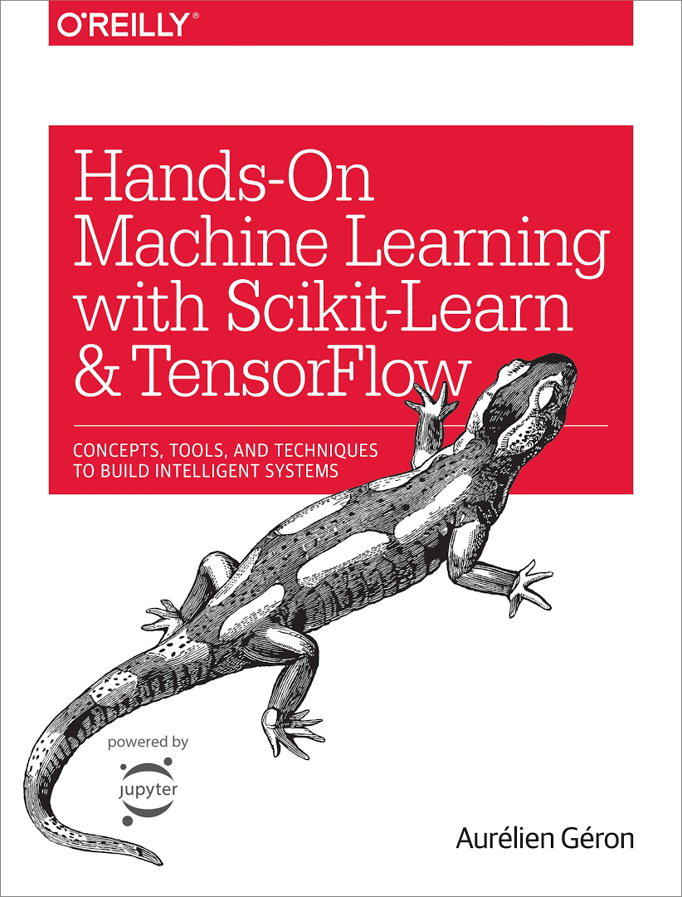

## 핸즈온 머신러닝

### Contents

#### 1. 머신러닝

- Chapter1 한눈에 보는 머신러닝
- Chapter2 머신러닝 프로젝트 처음부터 끝까지
- Chapter3 분류
- Chapter4 모델 훈련
- Chapter5 서포트 벡터 머신
- Chapter6 결정 트리
- Chapter7 앙상블 학습과 랜덤 포레스트
- Chapter8 차원 축소

#### 2. 신경망과 딥러닝

- Chapter9 텐서플로 시작하기
- Chapter10 인공 신경망 소개
- Chapter11 심층 신경망 훈련
- Chapter12 다중 머신과 장치를 위한 분산 텐서플로
- Chapter13 합성곱 신경망
- Chapter14 순환 신경망
- Chapter15 오토인코더
- Chapter16 강화 학습
