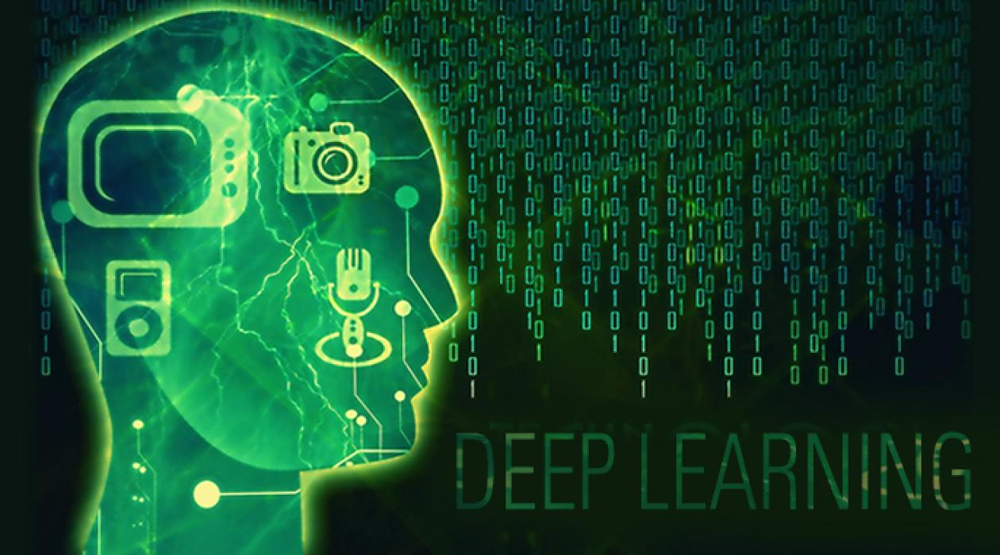

## 모두를 위한 딥러닝 강좌 시즌 1

[Youtube 강의 링크](https://www.youtube.com/watch?v=BS6O0zOGX4E&list=PLlMkM4tgfjnLSOjrEJN31gZATbcj_MpUm)

### Contents
- Chapter01 머신러닝의 개념과 용어
- Chapter02 Linear Regression 의 개념
- Chapter03 Linear Regression cost함수 최소화
- Chapter04 여러개의 입력(feature)의 Linear Regression
- Chapter05 Logistic (Regression) Classification
- Chapter06 Softmax Regression (Multinomial Logistic Regression)
- Chapter07 ML의 실용과 몇가지 팁
- Chapter08 딥러닝의 기본 개념과, 문제, 그리고 해결
- Chapter09 Neural Network 1: XOR 문제와 학습방법, Backpropagation
- Chapter10 Neural Network 2: ReLU and 초기값 정하기
- Chapter11 Convolutional Neural Networks
- Chapter12 Recurrent Neural Network
  
- Bonus1 Deep Deep Network AWS 에서 GPU와 돌려보기 (powered by AWS)
- Bonus2 AWS에서 저렴하게 Spot Instance를 터미네이션 걱정없이 사용하기 (powered by AWS)
- Bonus3 Google Cloud ML을 이용해 TensorFlow 실행하기
